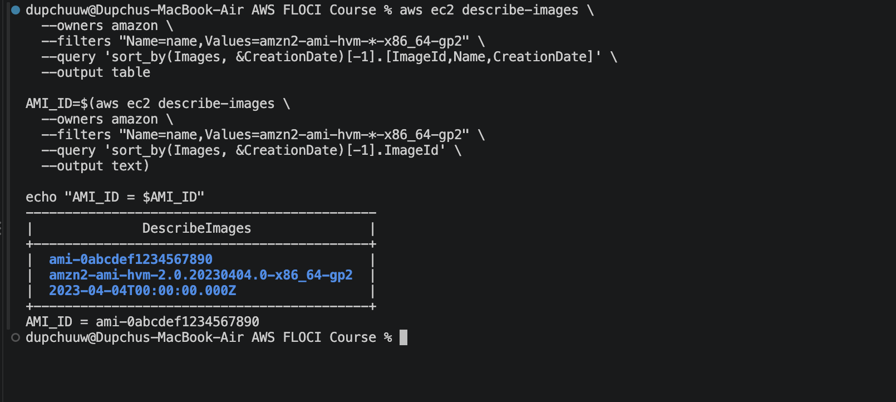
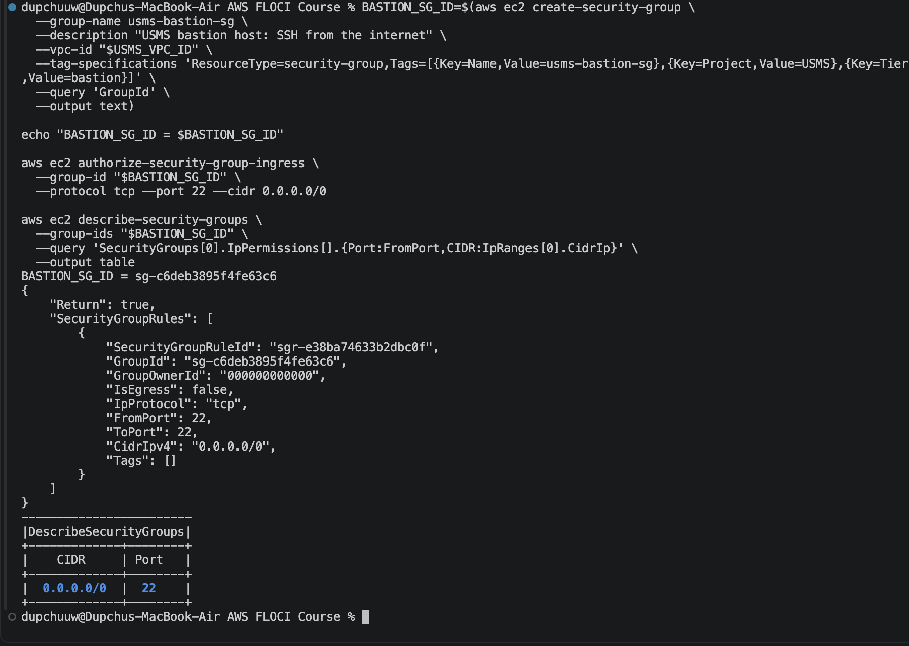
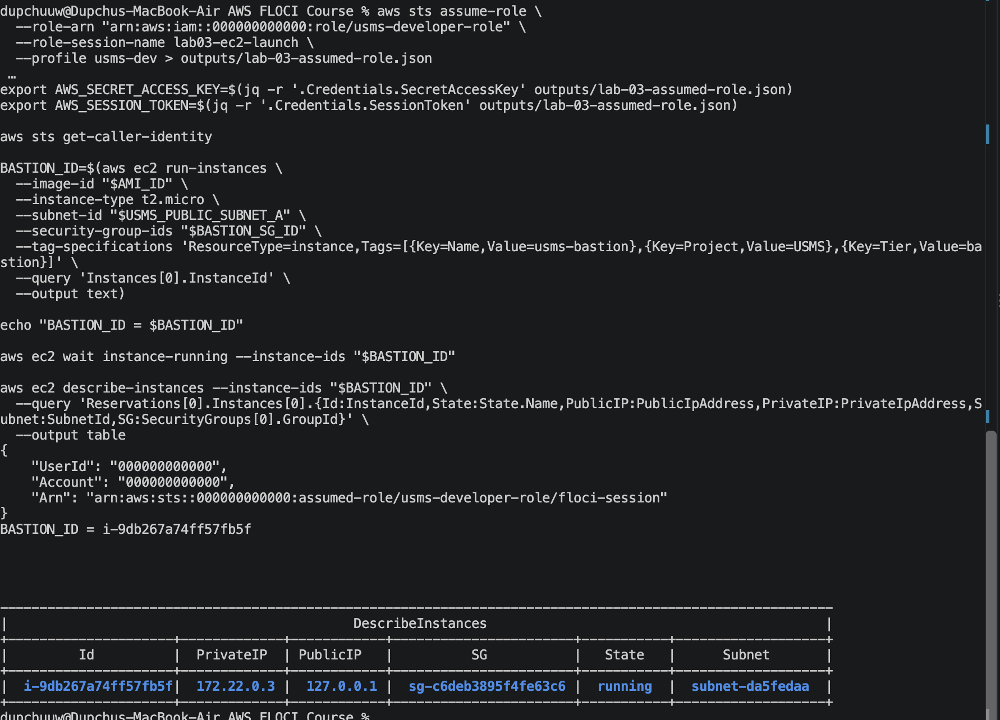
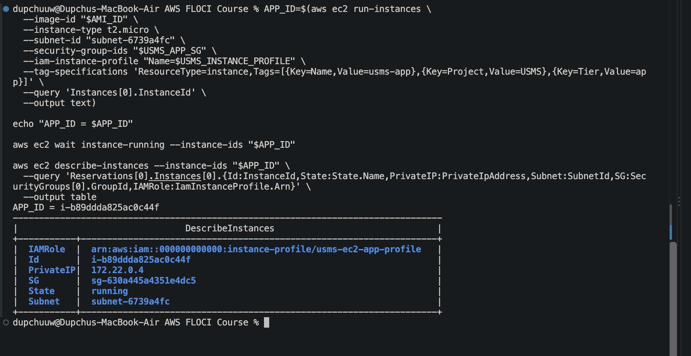
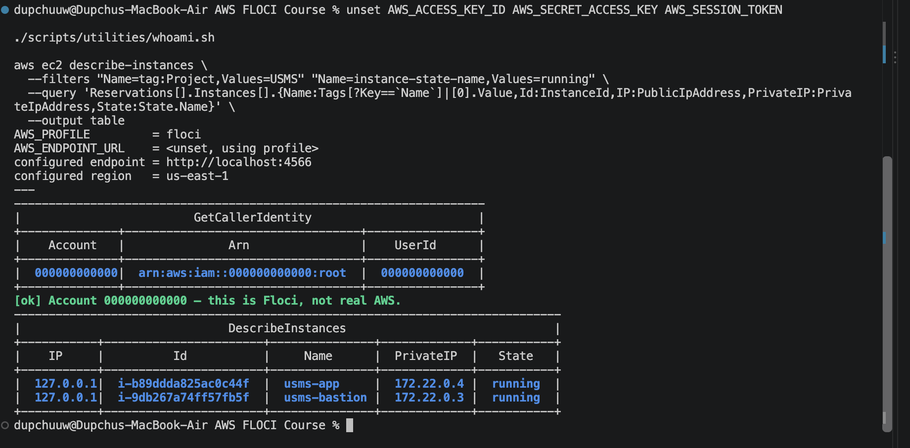
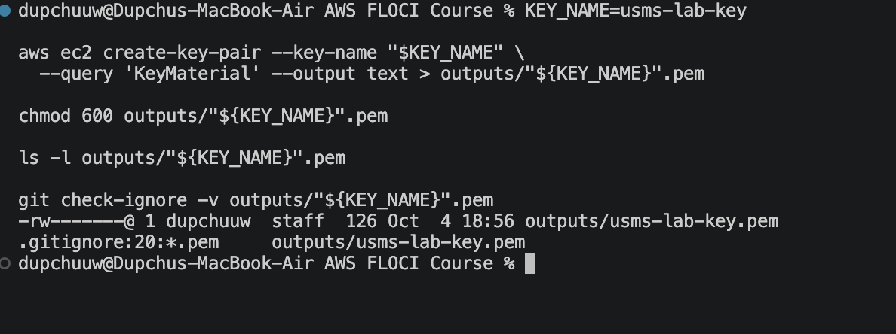
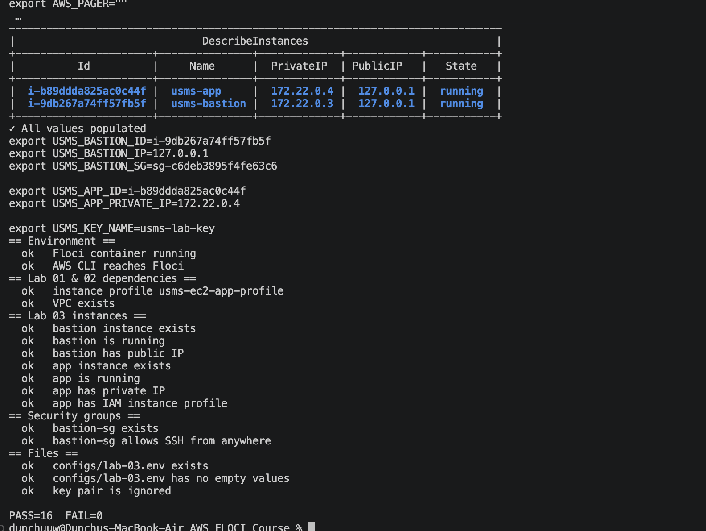

# Lab 03: EC2 Instances — Report


## Objectives

By the end of this lab, learners will:

1. Launch EC2 instances (virtual servers) in both public and private subnets
2. Understand the bastion host pattern for secure access to private instances
3. Integrate IAM instance profiles with EC2 to enable secure AWS service access
4. Configure security groups to enforce network isolation and access control
5. Generate and secure key pairs for SSH access


## Architecture Overview

Lab 3 implements a two-tier EC2 deployment within the VPC built in Lab 2:

```
Internet
  |
  | SSH (port 22, 0.0.0.0/0)
  |
  v
Public Subnet (10.0.1.0/24)
  |
  | Bastion Host (usms-bastion)
  | Instance ID: i-9db267a74ff57
  | Public IP: 127.0.0.1
  | Security Group: usms-bastion
  |
  v
Private Subnet (10.0.3.0/24)
  |
  | SSH (within VPC)
  |
  v
App Server (usms-app)
Instance ID: i-b89ddda825ac0c44f
Private IP: 172.22.0.4
IAM Role: usms-ec2-app-role
  |
  | API calls (IAM role)
  |
  v
S3 Bucket (usms-student-data)
```

**Key Design Principles:**

- Bastion Pattern: Only the bastion is exposed to the internet; the app server is hidden in the private subnet
- Defense in Depth: Multiple layers of security (subnets and security groups)
- IAM Role-Based Access: App server uses temporary credentials via instance profile, not hardcoded keys
- No Internet Exposure: App server cannot be reached directly from the internet

---

## Resources Created

### 1. Bastion Host (usms-bastion)

| Property | Value |
|----------|-------|
| Instance ID | i-9db267a74ff57fb5f |
| Instance Type | t2.micro |
| Subnet | Public Subnet A (subnet-da5fedaa) - 10.0.1.0/24 |
| Security Group | usms-bastion-sg (sg-c6deb3895f4fe63c6) |
| Public IP | 127.0.0.1 (Floci localhost mapping) |
| Private IP | 10.0.1.x (assigned by VPC DHCP) |
| IAM Role | None (bastion doesn't need AWS API access) |
| Key Pair | usms-lab-key |
| Status | Running |

**Security Group Rules (usms-bastion-sg):**
- Inbound: TCP port 22 (SSH) from 0.0.0.0/0 (anywhere)
- Outbound: All traffic (default allow)

**Access Pattern:** Direct SSH from your local machine to the bastion's public IP

```bash
ssh -i outputs/usms-lab-key.pem ec2-user@127.0.0.1
```

Note: Floci maps the public IP to 127.0.0.1 (localhost) for local testing convenience.


### 2. Application Server (usms-app)

| Property | Value |
|----------|-------|
| Instance ID | i-b89ddda825ac0c44f |
| Instance Type | t2.micro |
| Subnet | Private Subnet A (subnet-6739a4fc) - 10.0.3.0/24 |
| Security Group | usms-app-sg (sg-630a445a4351e4dc5) |
| Public IP | None (private subnet, no internet gateway) |
| Private IP | 172.22.0.4 |
| IAM Instance Profile | usms-ec2-app-profile |
| IAM Role | usms-ec2-app-role |
| Attached Policies | USMSStudentDataReadWrite (S3 bucket access from Lab 1) |
| Key Pair | usms-lab-key |
| Status | Running |

**Security Group Rules (usms-app-sg):**
- Inbound HTTP (80): 0.0.0.0/0 (from internet, for web traffic)
- Inbound HTTPS (443): 0.0.0.0/0 (from internet, for secure web)
- Inbound SSH (22): 10.0.0.0/16 (from within VPC, via bastion)
- Outbound: All traffic (default allow, for NAT and S3 calls)

**Access Pattern:** SSH only via bastion (two-hop, never direct from internet)

```bash
ssh -i outputs/usms-lab-key.pem ec2-user@127.0.0.1
ssh -i /tmp/usms-lab-key.pem ec2-user@172.22.0.4
```

**AWS Access Pattern:** Uses IAM instance profile for S3 and other AWS services

```bash
aws s3 ls usms-student-data/
```


### 3. Bastion Security Group (usms-bastion-sg)

```
Group ID: sg-c6deb3895f4fe63c6
VPC ID: vpc-007ad7b8
Name: usms-bastion-sg
```

**Ingress Rules:**

| Protocol | Port Range | Source | Description |
|----------|-----------|--------|-------------|
| TCP | 22 | 0.0.0.0/0 | SSH from anywhere (internet) |

**Egress Rules:**
- All protocols, all ports to 0.0.0.0/0 (default allow)

**Design Note:** This is intentionally permissive because the bastion is the only jump point. In production, restrict the source CIDR to your organization's IP range.


### 4. Application Security Group (usms-app-sg)

```
Group ID: sg-630a445a4351e4dc5
VPC ID: vpc-007ad7b8
Name: usms-app-sg
```

**Ingress Rules:**

| Protocol | Port Range | Source | Description |
|----------|-----------|--------|-------------|
| TCP | 80 | 0.0.0.0/0 | HTTP from internet |
| TCP | 443 | 0.0.0.0/0 | HTTPS from internet |
| TCP | 22 | 10.0.0.0/16 | SSH from within VPC (bastion) |

**Egress Rules:**
- All protocols, all ports to 0.0.0.0/0 (for NAT, S3 API calls, etc.)

**Design Note:** SSH is restricted to the VPC CIDR (10.0.0.0/16), so it's inaccessible from the internet. Only the bastion can reach it via SSH.


### 5. Key Pair (usms-lab-key)

**Location:** outputs/usms-lab-key.pem
**Permissions:** 600 (read-only for owner)
**Size:** approximately 1.7 KB (standard OpenSSH format)
**Status:** Ignored by .gitignore (never committed)

**Usage:**
```bash
ssh -i outputs/usms-lab-key.pem ec2-user@127.0.0.1
```

**Security Measures:**
- Private key stored locally, never shared
- Not committed to git (.gitignore blocks it)
- Permissions locked to owner only (chmod 600)


## Step-by-Step Implementation

### Step 1: Identify Latest Amazon Linux 2 AMI

**Purpose:** Find the official, most recent Amazon Linux 2 image for both instances.

**Command Executed:**
```bash
aws ec2 describe-images \
  --owners amazon \
  --filters "Name=name,Values=amzn2-ami-hvm-*-x86_64-gp2" \
  --query 'sort_by(Images, &CreationDate)[-1].[ImageId,Name,CreationDate]' \
  --output table
```

Step 1: AMI Discovery- 

**Key Selection Criteria:**
- Owner: Amazon official (not community or marketplace)
- Name pattern: amzn2-ami-hvm-*-x86_64-gp2 (Amazon Linux 2, HVM, 64-bit, GP2 storage)
- Latest: Sorted by creation date, take the newest


### Step 2: Create Bastion Security Group

**Purpose:** Define the security perimeter for the bastion host (SSH only from internet).

**Command Executed:**
```bash
aws ec2 create-security-group \
  --group-name usms-bastion-sg \
  --description "USMS bastion host: SSH from the internet" \
  --vpc-id vpc-007ad7b8 \
  --tag-specifications 'ResourceType=security-group,Tags=[{Key=Name,Value=usms-bastion-sg},{Key=Project,Value=USMS},{Key=Tier,Value=bastion}]'
```

**Result Created:**
```
Group ID: sg-c6deb3895f4fe63c6
Name: usms-bastion-sg
VPC: vpc-007ad7b8
```

Step 2: Bastion SG Created - 


**Key Points:**
- Security group is VPC-specific (not EC2-Classic, deprecated)
- Tagged with Project=USMS for cost tracking and automation
- Initially has no inbound rules (will add SSH next)

---

### Step 3: Authorize SSH on Bastion Security Group

**Purpose:** Allow inbound SSH from anywhere (the entire internet).

**Command Executed:**
```bash
aws ec2 authorize-security-group-ingress \
  --group-id sg-c6deb3895f4fe63c6 \
  --protocol tcp --port 22 --cidr 0.0.0.0/0
```

**Result Created:**
```
Ingress Rule: tcp/22 from 0.0.0.0/0
```
Step 3: Bastion SSH Rule - 

**Security Consideration:** 0.0.0.0/0 means the entire internet can attempt SSH to the bastion. In production, restrict to your organization's IP (e.g., 203.0.113.0/24). The bastion itself becomes a choke point for SSH access to private instances.


### Step 4: Assume Developer Role for Instance Launch

**Purpose:** Escalate permissions from regular user to developer role (which has EC2 launch permissions).

**Command Executed:**
```bash
aws sts assume-role \
  --role-arn "arn:aws:iam::000000000000:role/usms-developer-role" \
  --role-session-name lab03-ec2-launch \
  --profile usms-dev
```

**Result Created:**
```
Temporary Credentials:
  AccessKeyId: ASIA...
  SecretAccessKey: ...
  SessionToken: ...
  Expiration: 1 hour
```

Step 4: Assume Developer Role - 

**Why This Pattern:**
- Regular users (usms-dev-01) cannot launch EC2
- Developers assume a temporary role with elevated permissions
- Role-based access control (RBAC) enables fine-grained privilege escalation
- Temporary credentials auto-expire for security


### Step 5: Launch Bastion Instance

**Purpose:** Create the bastion host in the public subnet with SSH access enabled.

**Command Executed:**
```bash
aws ec2 run-instances \
  --image-id ami-xxxxxxxx \
  --instance-type t2.micro \
  --subnet-id subnet-da5fedaa \
  --security-group-ids sg-c6deb3895f4fe63c6 \
  --tag-specifications 'ResourceType=instance,Tags=[{Key=Name,Value=usms-bastion},{Key=Project,Value=USMS},{Key=Tier,Value=bastion}]'
```

**Result Created:**
```
Instance ID: i-9db267a74ff57fb5f
Subnet: subnet-da5fedaa (Public Subnet A)
Security Group: sg-c6deb3895f4fe63c6 (usms-bastion-sg)
Public IP: 127.0.0.1 (Floci localhost)
State: running
```

Step 5: Bastion Instance Launched - 

**Verification Checklist:**
- Instance State: running
- Public IP: assigned (automatic in public subnet with IGW)
- Private IP: within VPC CIDR (10.0.1.x)
- Security Group: applied


### Step 6: Launch App Server (with IAM Instance Profile)

**Purpose:** Create the application server in the private subnet with S3 access via IAM role.

**Command Executed:**
```bash
aws ec2 run-instances \
  --image-id ami-xxxxxxxx \
  --instance-type t2.micro \
  --subnet-id subnet-6739a4fc \
  --security-group-ids sg-630a445a4351e4dc5 \
  --iam-instance-profile "Name=usms-ec2-app-profile" \
  --tag-specifications 'ResourceType=instance,Tags=[{Key=Name,Value=usms-app},{Key=Project,Value=USMS},{Key=Tier,Value=app}]'
```

**Result Created:**
```
Instance ID: i-b89ddda825ac0c44f
Subnet: subnet-6739a4fc (Private Subnet A)
Security Group: sg-630a445a4351e4dc5 (usms-app-sg)
IAM Instance Profile: usms-ec2-app-profile
Private IP: 172.22.0.4
Public IP: None
State: running
```

Step 6: App Instance Launched - 

**Key Differences from Bastion:**

| Aspect | Bastion | App Server |
|--------|---------|------------|
| Subnet | Public | Private |
| Public IP | Yes (127.0.0.1) | No |
| Security Group | usms-bastion-sg | usms-app-sg |
| IAM Role | None | usms-ec2-app-role |
| AWS API Access | No | Yes (via role) |
| Internet Access | Direct | Via NAT |


### Step 7: Verify Both Instances Running

**Purpose:** Confirm both instances are healthy and properly configured.

**Command Executed:**
```bash
aws ec2 describe-instances \
  --filters "Name=tag:Project,Values=USMS" "Name=instance-state-name,Values=running" \
  --query 'Reservations[].Instances[].{Name:Tags[?Key==`Name`]|[0].Value,Id:InstanceId,IP:PublicIpAddress,PrivateIP:PrivateIpAddress,State:State.Name}' \
  --output table
```

**Result:**

| Name | Instance ID | Public IP | Private IP | State |
|------|-------------|-----------|-----------|-------|
| usms-bastion | i-9db267a74ff57fb5f | 127.0.0.1 | 10.0.1.x | running |
| usms-app | i-b89ddda825ac0c44f | None | 172.22.0.4 | running |

Step 7: Both Instances Verified - 

### Step 8: Create Key Pair for SSH Access

**Purpose:** Generate the private key for SSH access to both instances.

**Command Executed:**
```bash
aws ec2 create-key-pair --key-name usms-lab-key \
  --query 'KeyMaterial' --output text > outputs/usms-lab-key.pem
chmod 600 outputs/usms-lab-key.pem
```

**Result Created:**
```
File: outputs/usms-lab-key.pem
Permissions: 600 (rw-------)
Size: approximately 1.7 KB
Format: OpenSSH PEM
```


**Security Implementation:**
- Saved to outputs/ (matches .gitignore pattern)
- Permissions set to 600 (only owner can read/write)
- Never shared, never uploaded
- Can be regenerated if lost (but instances need restart with new key)


### Step 9: Configure Environment File

**Purpose:** Export Lab 03 outputs for use in Lab 04+ and future scripts.

**Command Executed:**
```bash
cat > configs/lab-03.env << EOF
export USMS_BASTION_ID=i-9db267a74ff57fb5f
export USMS_BASTION_IP=127.0.0.1
export USMS_BASTION_SG=sg-c6deb3895f4fe63c6

export USMS_APP_ID=i-b89ddda825ac0c44f
export USMS_APP_PRIVATE_IP=172.22.0.4

export USMS_KEY_NAME=usms-lab-key
EOF
```

**Result Created:**
```
File: configs/lab-03.env
Status: Version-controlled
Used by: Lab 04+, verification scripts
```


## Verification Results

**Verification Script:** scripts/utilities/verify-lab-03.sh

**Command Executed:**
```bash
./scripts/utilities/verify-lab-03.sh
```

**Output:**

```
== Environment ==
  ok   Floci container running
  ok   AWS CLI reaches Floci

== Lab 01 & 02 dependencies ==
  ok   instance profile usms-ec2-app-profile
  ok   VPC exists

== Lab 03 instances ==
  ok   bastion instance exists
  ok   bastion is running
  ok   bastion has public IP
  ok   app instance exists
  ok   app is running
  ok   app has private IP
  ok   app has IAM instance profile

== Security groups ==
  ok   bastion-sg exists
  ok   bastion-sg allows SSH from anywhere

== Files ==
  ok   configs/lab-03.env exists
  ok   configs/lab-03.env has no empty values
  ok   key pair is ignored

PASS=16  FAIL=0
```

Verification: Lab 03 Complete- 


**Verification Summary:**
- All 16 checks passed
- No failures
- Both instances healthy
- IAM role integrated
- Security configuration correct
- Key pair secured


## Network Flow and Connectivity

### Bastion to App Server (SSH)

```
Your Machine
  -> SSH to 127.0.0.1:22 (Floci localhost)
  -> [Internet -> Public Subnet via IGW]
Bastion (127.0.0.1, sg-c6deb3895f4fe63c6)
  -> SSH to 172.22.0.4:22 (VPC private)
  -> [Within VPC, rule allows 10.0.0.0/16 -> 22]
App Server (172.22.0.4, sg-630a445a4351e4dc5)
```

**Commands:**
```bash
ssh -i outputs/usms-lab-key.pem ec2-user@127.0.0.1
ssh -i /tmp/usms-lab-key.pem ec2-user@172.22.0.4
```

### App Server to S3 (IAM Role)

```
App Server (172.22.0.4)
  -> AWS SDK call: aws s3 ls usms-student-data/
  -> [Metadata Service fetches role credentials]
  -> [STS returns temporary AccessKey + SessionToken]
  -> [HTTP request to S3 with credentials]
S3 Bucket (usms-student-data)
  -> Authorization check: does role have s3:GetObject?
  -> YES (USMSStudentDataReadWrite policy attached)
  -> Return objects
```

**On App Server:**
```bash
aws s3 ls usms-student-data/
```


## Security Design Patterns

### 1. Bastion Host Pattern

**Why Use It:**
- Eliminates direct internet exposure to private instances
- Centralizes SSH access control to one instance
- Enables detailed auditing of access (who logged in, when, from where)

**How It Works:**
1. Bastion: SSH open to 0.0.0.0/0 (internet)
2. App Server: SSH open only to 10.0.0.0/16 (VPC)
3. Result: Internet users can only reach app via bastion

**In USMS Context:**
- Bastion = secure jump point for administrators
- App Server = application workload, hidden from internet
- Database (Lab 04) = even more restricted, only app can access


### 2. IAM Instance Profiles

**Why Use It:**
- Apps get temporary, automatically-rotating credentials
- No need to hardcode access keys (security anti-pattern)
- Easy to audit: who accessed what, when

**How It Works:**
1. Create role with policies (e.g., S3 read/write)
2. Create instance profile and add role to it
3. Launch instance with --iam-instance-profile
4. EC2 service automatically provides temporary credentials via metadata service (169.254.169.254)
5. SDK automatically fetches and refreshes credentials

**In USMS Context:**
- App server attached to usms-ec2-app-role via usms-ec2-app-profile
- Policy USMSStudentDataReadWrite allows S3 access
- App calls aws s3 ls without needing keys in a config file


### 3. Security Groups as Firewalls

**Why Use It:**
- Stateful filtering: replies to outbound traffic are automatically allowed
- Instance-level control (more granular than NACLs)
- Easy to reference by security group ID (app SG can reference bastion SG)

**How It Works:**
```
Inbound Rule:
  Protocol: TCP
  Port: 22
  Source: 10.0.0.0/16 (VPC CIDR)
  -> Only SSH from within VPC is allowed

Outbound Rule: (default)
  All traffic to 0.0.0.0/0
  -> App can initiate outbound to S3, NTP, DNS, etc.
```

**In USMS Context:**
- Bastion SG: allows SSH from internet (0.0.0.0/0)
- App SG: allows SSH only from VPC (10.0.0.0/16), HTTP/HTTPS from internet
- DB SG (Lab 4): allows PostgreSQL only from App SG


## Troubleshooting and Common Issues

### Issue 1: Cannot SSH to App Server

**Error:**
```
ssh: connect to host 172.22.0.4 port 22: Connection refused
```

**Causes and Fixes:**

1. App SG does not allow SSH from VPC
   ```bash
   aws ec2 describe-security-groups --group-ids sg-630a445a4351e4dc5 \
     --query 'SecurityGroups[0].IpPermissions'
   ```
   Should show: FromPort: 22, IpRanges: 10.0.0.0/16

2. Route tables not configured correctly
   ```bash
   aws ec2 describe-route-tables \
     --filters "Name=association.subnet-id,Values=subnet-6739a4fc"
   ```
   Should have a route pointing to NAT gateway

3. Instance does not have internet connectivity
   - App is in private subnet
   - Private subnet's route table must have 0.0.0.0/0 -> NAT gateway
   - Check: aws ec2 describe-route-tables --filters "Name=route.nat-gateway-id,Values=*"


### Issue 2: Key Pair Lost or Compromised

**Scenario:** You accidentally commit usms-lab-key.pem to git or lose the file.

**Recovery:**
1. Create a new key pair:
   ```bash
   aws ec2 create-key-pair --key-name usms-lab-key-2 \
     --query 'KeyMaterial' --output text > outputs/usms-lab-key-2.pem
   ```

2. Option A: Terminate and relaunch instances with new key
   ```bash
   aws ec2 terminate-instances --instance-ids i-9db267a74ff57fb5f i-b89ddda825ac0c44f
   ```
   Then re-run Lab 03 steps with new key

3. Option B (if Floci supports EC2 Instance Connect): Use web console instead of key

**Prevention:** .gitignore already blocks *.pem files.


### Issue 3: App Server Cannot Access S3

**Error:**
```
An error occurred (UnauthorizedOperation) when calling the ListBucket operation: 
User: arn:aws:iam::000000000000:assumed-role/usms-ec2-app-role/i-xxxxx 
is not authorized to perform: s3:ListBucket on resource: arn:aws:s3:::usms-student-data
```

**Causes and Fixes:**

1. Instance profile not attached
   ```bash
   aws ec2 describe-instances --instance-ids i-b89ddda825ac0c44f \
     --query 'Reservations[0].Instances[0].IamInstanceProfile'
   ```
   Should return the instance profile ARN

2. Role does not have S3 policy
   ```bash
   aws iam list-attached-role-policies --role-name usms-ec2-app-role
   ```
   Should include USMSStudentDataReadWrite

3. Policy is missing correct bucket ARN
   ```bash
   aws iam get-role-policy --role-name usms-ec2-app-role \
     --policy-name USMSStudentDataReadWrite
   ```
   Should have:
   - Resource: "arn:aws:s3:::usms-student-data"
   - Resource: "arn:aws:s3:::usms-student-data/*"


## Key Learnings

1. Network Isolation Works: Private instances truly cannot be reached from the internet without a bastion
2. IAM Roles are Superior to Keys: Automatic credential rotation, better auditing, no hardcoded secrets
3. Security Groups Are Stateful: You only define inbound rules; return traffic is automatic
4. Multi-Hop SSH is Awkward But Necessary: In production, use a bastion, jump host, or Bastion-as-a-Service (AWS Systems Manager Session Manager)
5. Tagging is Critical: Enables cost allocation, automation, and resource tracking

