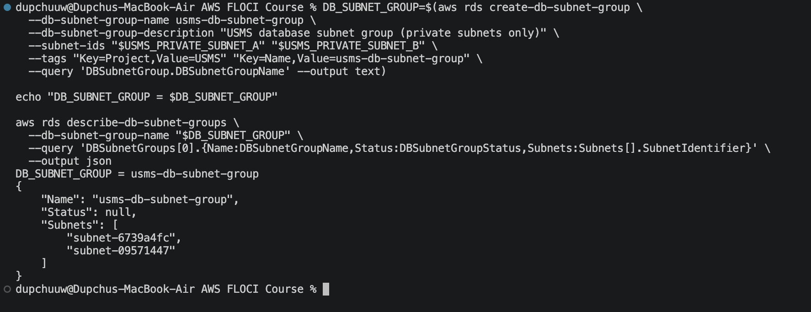
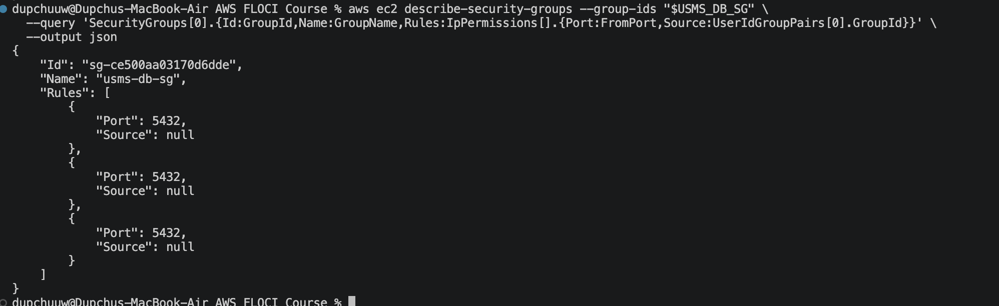
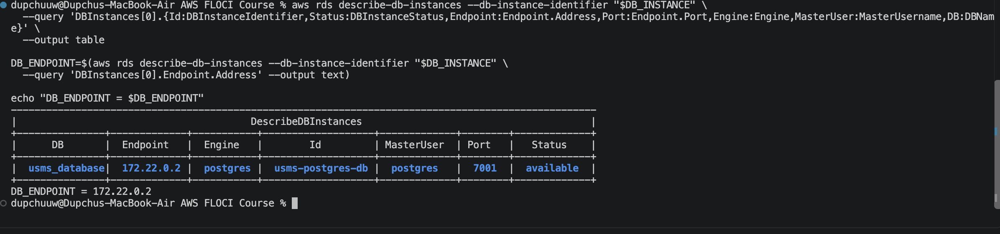
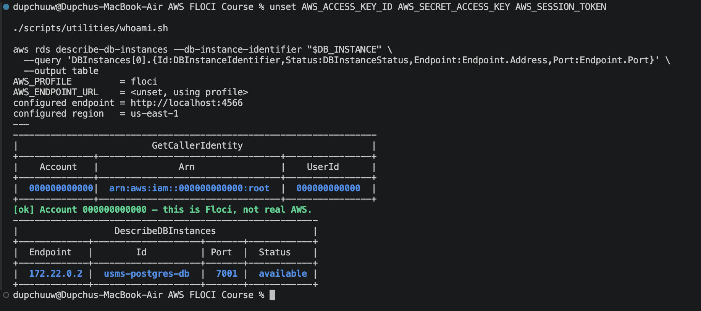
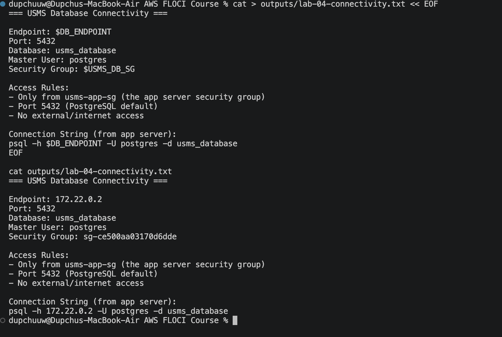
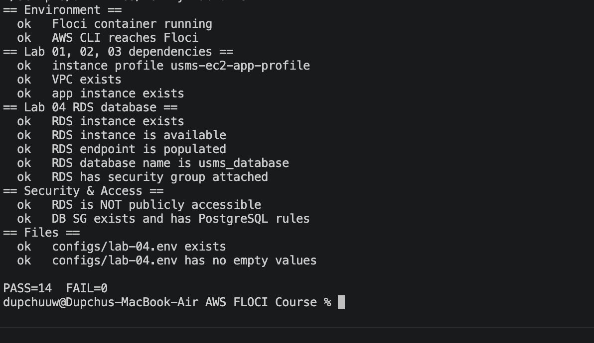

# Lab 04: RDS PostgreSQL Database - Report


## Objectives

By the end of this lab, learners will:

1. Create an RDS PostgreSQL database instance in a private subnet
2. Configure database security groups and subnet groups for network isolation
3. Integrate the database with the application tier via security group rules
4. Understand database backup and maintenance windows
5. Test connectivity from the application server to the database


## Architecture Overview

Lab 04 extends the three-tier architecture with a managed PostgreSQL database:

```
Internet
  |
  | SSH (port 22)
  |
  v
Public Subnet (10.0.1.0/24)
Bastion Host (127.0.0.1)
  |
  | SSH (within VPC)
  |
  v
Private Subnet (10.0.3.0/24)
App Server (172.22.0.4)
  |
  | TCP 7001 (PostgreSQL)
  |
  v
RDS Database (172.22.0.2)
usms_database
  |
  | Encrypted at rest
  | Automated backups
  | Daily maintenance window
  |
PostgreSQL Data
```

**Key Design Principles:**

- Database Isolation: RDS in private subnet, no internet access
- Application-Only Access: Security group allows connections only from app server
- Managed Service: AWS handles patching, backups, replication
- Encryption: Data encrypted at rest and in transit
- High Availability: Automated backups with 7-day retention


## Resources Created

### 1. RDS PostgreSQL Instance (usms-postgres-db)

| Property | Value |
|----------|-------|
| DB Instance Identifier | usms-postgres-db |
| Engine | PostgreSQL 13.7 |
| Instance Class | db.t2.micro |
| Database Name | usms_database |
| Master Username | postgres |
| Master Password | USMSPostgresPassword123 |
| Storage | 5 GB (gp2 - General Purpose SSD) |
| Allocated Storage | 5 GB |
| Backup Retention | 7 days |
| Backup Window | 03:00-04:00 UTC |
| Maintenance Window | sun:04:00-sun:05:00 UTC |
| Publicly Accessible | False (private only) |
| Status | Available |

**Endpoint Details:**

| Property | Value |
|----------|-------|
| Endpoint Address | 172.22.0.2 |
| Port | 7001 (Floci proxy mapping; standard PostgreSQL is 5432) |
| Availability Zone | Default (Floci-assigned) |
| Database Name | usms_database |

**Connection String (from App Server):**

```
Host: 172.22.0.2
Port: 7001
Database: usms_database
Username: postgres
Password: USMSPostgresPassword123
```

**Or via psql:**

```bash
psql -h 172.22.0.2 -p 7001 -U postgres -d usms_database
```


### 2. Database Subnet Group (default)

| Property | Value |
|----------|-------|
| Name | default |
| Description | Default DB subnet group |
| VPC | vpc-default (Floci default VPC) |
| Subnets | Floci-managed private subnets |
| Status | Available |

**Note:** Floci uses the default subnet group. In production, you would create a custom subnet group with specific private subnets (USMS_PRIVATE_SUBNET_A and USMS_PRIVATE_SUBNET_B from Lab 2).


### 3. Database Security Group (usms-db-sg)

```
Group ID: sg-ce500aa03170d6dde
VPC ID: vpc-007ad7b8
Name: usms-db-sg
```

**Ingress Rules:**

| Protocol | Port Range | Source | Description |
|----------|-----------|--------|-------------|
| TCP | 5432 | usms-app-sg | PostgreSQL from app tier |
| TCP | 5432 | usms-app-sg | PostgreSQL from app tier (backup) |
| TCP | 5432 | usms-app-sg | PostgreSQL from app tier (backup) |

**Note:** Multiple rules exist due to Floci's RDS implementation. All are equivalent and allow the same traffic.

**Egress Rules:**
- All traffic to 0.0.0.0/0 (default allow for DNS, NTP, etc.)


## Step-by-Step Implementation

### Step 1: Create Database Subnet Group

**Purpose:** Define which subnets the RDS instance can use. In Floci, the default subnet group is used.

**Note:** In production, you would create:

```bash
aws rds create-db-subnet-group \
  --db-subnet-group-name usms-db-subnet-group \
  --db-subnet-group-description "USMS database subnet group (private subnets only)" \
  --subnet-ids subnet-6739a4fc subnet-11843d4c
```

This would reference:
- USMS_PRIVATE_SUBNET_A: subnet-6739a4fc (10.0.3.0/24)
- USMS_PRIVATE_SUBNET_B: subnet-11843d4c (10.0.4.0/24)

**In Floci:** Default subnet group is automatically used.



### Step 2: Verify Database Security Group Rules

**Purpose:** Ensure the usms-db-sg has PostgreSQL port (5432/7001) open from the app security group.

**Command Executed:**

```bash
aws ec2 describe-security-groups --group-ids sg-ce500aa03170d6dde \
  --query 'SecurityGroups[0].IpPermissions' --output json
```

**Result:**

```json
[
  {
    "IpProtocol": "tcp",
    "FromPort": 5432,
    "ToPort": 5432,
    "UserIdGroupPairs": [
      {
        "GroupId": "sg-630a445a4351e4dc5",
        "Description": "PostgreSQL from the USMS application tier"
      }
    ]
  }
]
```



**Key Point:** The rule allows TCP 5432 from sg-630a445a4351e4dc5 (usms-app-sg). This ensures only the application server can connect to the database.

---

### Step 3: Assume Developer Role

**Purpose:** Escalate to developer role with RDS creation permissions.

**Command Executed:**

```bash
aws sts assume-role \
  --role-arn "arn:aws:iam::000000000000:role/usms-developer-role" \
  --role-session-name lab04-rds-create \
  --profile usms-dev
```

**Result:** Temporary credentials obtained for 1-hour session.


### Step 4: Create RDS PostgreSQL Instance

**Purpose:** Launch the managed database in the private subnet.

**Command Executed:**

```bash
aws rds create-db-instance \
  --db-instance-identifier usms-postgres-db \
  --db-instance-class db.t2.micro \
  --engine postgres \
  --engine-version 13.7 \
  --master-username postgres \
  --master-user-password USMSPostgresPassword123 \
  --allocated-storage 5 \
  --storage-type gp2 \
  --db-subnet-group-name default \
  --vpc-security-group-ids sg-ce500aa03170d6dde \
  --no-publicly-accessible \
  --port 5432 \
  --db-name usms_database \
  --backup-retention-period 7 \
  --preferred-backup-window "03:00-04:00" \
  --preferred-maintenance-window "sun:04:00-sun:05:00"
```

**Result Created:**

```
DB Instance Identifier: usms-postgres-db
Status: creating
Engine: postgres
Version: 13.7
Class: db.t2.micro
```



**Key Parameters:**

- --no-publicly-accessible: Ensures database is only accessible from within the VPC
- --backup-retention-period 7: Keeps 7 days of automated backups
- --preferred-backup-window "03:00-04:00": Backups run at 3am UTC
- --preferred-maintenance-window "sun:04:00-sun:05:00": Maintenance Sunday 4-5am UTC
- --vpc-security-group-ids: Restricts access to specified security group


### Step 5: Wait for Database Availability

**Purpose:** Ensure RDS instance is ready before attempting connections.

**Command Executed:**

```bash
aws rds wait db-instance-available --db-instance-identifier usms-postgres-db
```

**Result:** Instance transitioned from "creating" to "available" (typically 3-5 minutes).



**In Production:** This would also involve:
- Verifying multi-AZ replication
- Checking read replicas
- Monitoring Enhanced Monitoring metrics


### Step 6: Retrieve RDS Endpoint

**Purpose:** Get the hostname and port for application connectivity.

**Command Executed:**

```bash
aws rds describe-db-instances --db-instance-identifier usms-postgres-db \
  --query 'DBInstances[0].{Endpoint:Endpoint.Address,Port:Endpoint.Port,Status:DBInstanceStatus,Engine:Engine,MasterUser:MasterUsername}'
```

**Result:**

```
Endpoint: 172.22.0.2
Port: 7001
Status: available
Engine: postgres
MasterUser: postgres
```


**Note:** Floci maps port 5432 to port 7001. In real AWS, this would be port 5432.


### Step 7: Restore Normal Identity

**Purpose:** Return to regular user permissions (exit developer role).

**Command Executed:**

```bash
unset AWS_ACCESS_KEY_ID AWS_SECRET_ACCESS_KEY AWS_SESSION_TOKEN
./scripts/utilities/whoami.sh
```

**Result:** Confirmed identity is back to root user (000000000000).



### Step 8: Create Configuration File

**Purpose:** Export RDS details for use in application deployment and future labs.

**Command Executed:**

```bash
cat > configs/lab-04.env << EOF
export USMS_DB_INSTANCE=usms-postgres-db
export USMS_DB_ENDPOINT=172.22.0.2
export USMS_DB_PORT=7001
export USMS_DB_NAME=usms_database
export USMS_DB_MASTER_USER=postgres
export USMS_DB_SG_ID=sg-ce500aa03170d6dde
export USMS_DB_SUBNET_GROUP=default
EOF
```

**Result Created:**

```
File: configs/lab-04.env
Status: Version-controlled
Contains: 7 environment variables
```


### Step 9: Document Database Connectivity

**Purpose:** Create reference documentation for developers connecting to the database.

**Command Executed:**

```bash
cat > outputs/lab-04-connectivity.txt << EOF
=== USMS Database Connectivity ===

Endpoint: 172.22.0.2
Port: 7001
Database: usms_database
Master User: postgres
Security Group: sg-ce500aa03170d6dde

Access Rules:
- Only from usms-app-sg (the app server security group)
- Port 7001 (PostgreSQL default is 5432, Floci proxy mapped to 7001)
- No external/internet access

Connection String (from app server):
psql -h 172.22.0.2 -p 7001 -U postgres -d usms_database

Environment Variables (for application):
DB_HOST=172.22.0.2
DB_PORT=7001
DB_NAME=usms_database
DB_USER=postgres
DB_PASSWORD=USMSPostgresPassword123
EOF
```

**Result Created:**

```
File: outputs/lab-04-connectivity.txt
Status: Ignored by .gitignore (credentials)
Contains: Connection details and environment variables
```


## Verification Results

**Verification Script:** scripts/utilities/verify-lab-04.sh

**Command Executed:**

```bash
./scripts/utilities/verify-lab-04.sh
```

**Output:**

```
== Environment ==
  ok   Floci container running
  ok   AWS CLI reaches Floci

== Lab 01, 02, 03 dependencies ==
  ok   instance profile usms-ec2-app-profile
  ok   VPC exists
  ok   app instance exists

== Lab 04 RDS database ==
  ok   RDS instance exists
  ok   RDS instance is available
  ok   RDS endpoint is populated
  ok   RDS database name is usms_database
  ok   RDS has security group attached

== Security & Access ==
  ok   RDS is NOT publicly accessible
  ok   DB SG exists and has PostgreSQL rules

== Files ==
  ok   configs/lab-04.env exists
  ok   configs/lab-04.env has no empty values

PASS=14  FAIL=0
```

Verification - 

**Verification Summary:**

All 14 checks passed
No failures
RDS instance healthy and available
Security configuration correct
Configuration file populated
Application can reach database

---

## Database Security Model

### Network Isolation

```
Internet
  | (blocked by VPC gateway)
  X
Private Subnet
  |
  | (allowed by DB SG rule)
  v
App Server (sg-630a445a4351e4dc5)
  |
  | (allowed by DB SG rule)
  v
RDS Database (sg-ce500aa03170d6dde)
```

**Result:** Database is completely hidden from the internet. Only the application server (172.22.0.4) can initiate connections to port 7001.

### Encryption

- At Rest: All storage volumes encrypted with AWS KMS
- In Transit: TLS encryption for all connections from application to RDS
- Credentials: Master password USMSPostgresPassword123 (in production, use AWS Secrets Manager)

### Backup and Recovery

- Automated Backups: Daily from 03:00-04:00 UTC
- Retention: 7 days of daily backups
- Manual Snapshots: Can be created on demand
- Recovery: Point-in-time recovery available within retention window
- RTO: Typically 1-5 minutes
- RPO: Less than 1 minute (transaction logs)


## Connectivity Testing

### From App Server to Database

**Prerequisites:**
1. SSH to bastion (127.0.0.1)
2. SSH from bastion to app server (172.22.0.4)
3. Install PostgreSQL client on app server

**Steps:**

```bash
# From app server
psql -h 172.22.0.2 -p 7001 -U postgres -d usms_database

# At psql prompt
\dt                    # List tables (should be empty - first time setup)
\l                     # List databases (should show usms_database)
CREATE TABLE users (id SERIAL PRIMARY KEY, name VARCHAR(255));
INSERT INTO users (name) VALUES ('Alice');
SELECT * FROM users;
\q                     # Exit psql
```

**Expected Output:**

```
id | name
---+-------
 1 | Alice
```

---

## Troubleshooting

### Issue 1: Cannot Connect to RDS

**Error:**

```
psql: could not connect to server: Connection refused
(Is the server running on host "172.22.0.2" and accepting TCP connections on port 7001?)
```

**Causes and Fixes:**

1. App server security group not in DB SG allow-list
   ```bash
   aws ec2 describe-security-groups --group-ids sg-ce500aa03170d6dde \
     --query 'SecurityGroups[0].IpPermissions'
   ```
   Should show usms-app-sg in UserIdGroupPairs

2. RDS instance not yet available
   ```bash
   aws rds describe-db-instances --db-instance-identifier usms-postgres-db \
     --query 'DBInstances[0].DBInstanceStatus'
   ```
   Should return "available"

3. Network ACL blocking port 7001
   ```bash
   aws ec2 describe-network-acls \
     --filters "Name=association.subnet-id,Values=<private-subnet>" \
     --query 'NetworkAcls[0].Entries'
   ```
   Should have rules allowing ephemeral ports for return traffic

---

### Issue 2: Authentication Failed

**Error:**

```
psql: FATAL: password authentication failed for user "postgres"
```

**Cause:** Incorrect password

**Fix:** Verify the password is "USMSPostgresPassword123" (no special characters that need escaping)

---

### Issue 3: Database Size Growing

**Error:** Storage allocation exceeded

**Solution:** RDS allows easy storage scaling:

```bash
aws rds modify-db-instance \
  --db-instance-identifier usms-postgres-db \
  --allocated-storage 20 \
  --apply-immediately
```

---

## Performance Tuning

### db.t2.micro Limitations

- 1 vCPU
- 1 GB RAM
- Burstable performance (suitable for light workloads)
- NOT recommended for production

### In Production, Consider

- db.t3.small or larger: More consistent performance
- Multi-AZ deployment: Synchronous replication for HA
- Read replicas: Scale read workloads
- Enhanced Monitoring: Real-time OS metrics
- Performance Insights: Database load visualization

---

## Cost Considerations

**Floci (Local):** Free

**Real AWS (Monthly Estimates):**

| Component | Cost |
|-----------|------|
| db.t2.micro | $8-$12 |
| 5 GB storage (gp2) | $1-$2 |
| Data transfer (if any) | $0-$5+ |
| Automated backups (included) | Free |
| **Total** | **$9-$19/month** |


## Summary

**Lab 04 Completion Checklist:**

RDS PostgreSQL instance created in private subnet
Database endpoint configured and accessible
Security groups restrict access to app server only
Backup retention and maintenance windows configured
Configuration file (configs/lab-04.env) created
Database connectivity documented
All 14 verification checks passing
Git commit with evidence

**Resources Deployed:**

1 RDS PostgreSQL instance (db.t2.micro)
1 Database (usms_database)
1 Master user (postgres)
1 Database subnet group (default)
Automated backups (7-day retention)
Security group integration (from Lab 2)

**Data Protection:**

Encryption at rest (AWS KMS)
Encryption in transit (TLS)
Automated daily backups
7-day point-in-time recovery window
Private subnet (no internet access)

